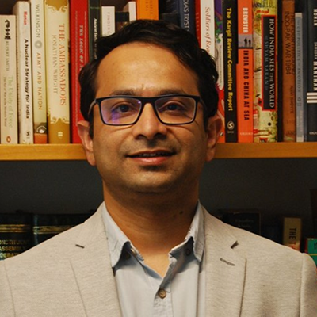
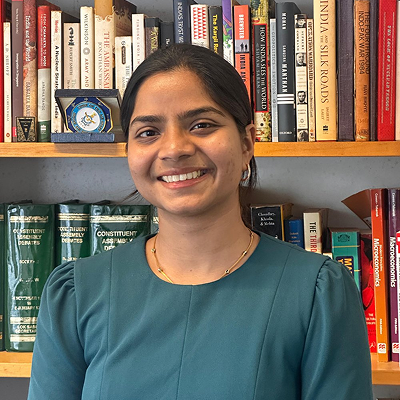
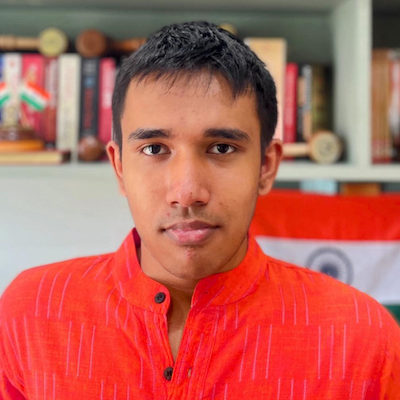
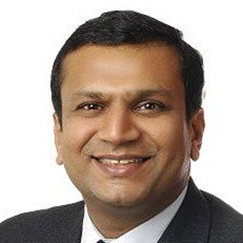

```{=html}
<div class="cm-page">
  <section class="cm-hero" aria-labelledby="page-title">
    <div class="cm-container cm-hero__inner">
      <h1 id="page-title">Critical Minerals Desk</h1>
      <div class="cm-hero__copy">
        <p>Critical mineral supply chains have become an arena of geopolitical and geoeconomic contestation. Mining and processing capacity remains concentrated in a few countries, especially China, even as demand grows for materials used in energy systems, advanced manufacturing, and strategic technologies.</p>
        <p>The Critical Minerals Desk at the Takshashila Institution studies the policy and geopolitical issues around these supply chains from an Indian perspective, to help build a more resilient critical mineral supply for India.</p>
      </div>
    </div>
  </section>

  <main>
    <section class="cm-section cm-featured" id="featured-research" aria-labelledby="featured-research-title">
      <div class="cm-container cm-featured__grid">
        <div class="cm-featured__context">
          <h2 id="featured-research-title">Featured Research</h2>
          <p>Interactive work from the Critical Minerals Desk.</p>
        </div>
        <article class="cm-featured__panel">
          <h3>India Critical Minerals Dashboard</h3>
          <p class="cm-featured__blurb">A mineral-by-mineral analysis of India’s list of 51 critical minerals, scored across ten vectors to distinguish immediate vulnerabilities from lower-priority concerns.</p>
          <p class="cm-featured__byline">Tannmay Kumarr Baid and Shobhankita Reddy</p>
          <p class="cm-featured__status"><span aria-hidden="true"></span> Live dashboard</p>
          <a class="cm-featured__link" href="https://indiacriticalminerals.com/">Explore the dashboard →</a>
        </article>
      </div>
    </section>

    <section class="cm-section cm-course" id="course">
      <div class="cm-container cm-course__inner">
        <h2>Want to build your expertise in <span>critical minerals</span>?</h2>
        <p class="cm-course__description">Politics and Policy of Critical Minerals is our four-week online Expert Capsule Course for professionals, students, and others who want to understand how geology, geopolitics, markets, technology, and state power shape mineral supply chains. Through live webinars, real-world case studies, expert guest lectures, and discussions, the course examines China’s dominance, the difficulty of reducing dependence on China, competing national strategies, India’s policy choices, and the limits of substitution and recycling. The first edition brought together 65 students interested in the geopolitical questions shaping this decade.</p>
        <p class="cm-course__availability">The next edition is expected in September 2027. <a href="https://docs.google.com/forms/d/e/1FAIpQLSc5-jqC3dqh3DhO7NTNKL95n9_MIs1Z1KzdM-AOaIsqhOYtjQ/viewform?ouid=115944996608306195102&amp;usp=sharing">Register your interest.</a></p>
        <a class="cm-primary-button" href="https://takshashila.org.in/pages/policy-school/ecc-critical-minerals.html">View Course Details</a>
      </div>
    </section>

    <section class="cm-section cm-container" id="research">
      <div class="cm-section-heading">
        <h2>Our Research</h2>
      </div>
      <div class="cm-carousel" data-carousel>
        <div class="cm-card-track" data-carousel-track>
          <a class="cm-content-card" href="https://takshashila.org.in/content/publications/20260123-India-Should-Double-Down-On-Rare-Earth-Recycling.html">
            <h3>India Should Double Down on Rare Earth Recycling</h3>
            <p>Tannmay Kumarr Baid, Pranay Kotasthane, Narayan Ramachandran</p>
            <span>Read more <span aria-hidden="true">→</span></span>
          </a>
          <a class="cm-content-card" href="https://takshashila.org.in/content/publications/China-Ga-Ge-Export-Restrictions-29032026.html">
            <h3>Sand Slipping Through Fingers</h3>
            <p>Amit Kumar, Pranay Kotasthane</p>
            <span>Read more <span aria-hidden="true">→</span></span>
          </a>
          <a class="cm-content-card" href="https://takshashila.org.in/content/publications/20241217-assessing-nature-of-indias-critical-minerals.html">
            <h3>Assessing India’s Critical Minerals Vulnerabilities vis-à-vis China</h3>
            <p>Rakshith Shetty</p>
            <span>Read more <span aria-hidden="true">→</span></span>
          </a>
          <a class="cm-content-card" href="https://takshashila.org.in/content/publications/20230131-The-Rare-Earth-Elements-Opportunity-for-India.html">
            <h3>The Rare Earth Elements Opportunity for India</h3>
            <p>Shrikrishna Upadhyaya, Pranay Kotasthane</p>
            <span>Read more <span aria-hidden="true">→</span></span>
          </a>
          <a class="cm-content-card" href="https://takshashila.org.in/content/publications/20201224-a-rare-earths-strategy-for-india.html">
            <h3>A Rare Earths Strategy for India</h3>
            <p>Narayan Ramachandran, Aditya Pareek, Anirudh Kanisetti</p>
            <span>Read more <span aria-hidden="true">→</span></span>
          </a>
          <a class="cm-content-card" href="https://takshashila.org.in/content/publications/20210228-a-rare-earths-strategy-for-india.html">
            <h3>Blue Paper: A Rare Earths Strategy for India</h3>
            <p>Anirudh Kanisetti</p>
            <span>Read more <span aria-hidden="true">→</span></span>
          </a>
        </div>
        <div class="cm-carousel-controls" aria-label="Research carousel controls">
          <button type="button" data-carousel-prev aria-label="Previous research">&lt;</button>
          <button type="button" data-carousel-next aria-label="Next research">&gt;</button>
        </div>
      </div>
    </section>

    <section class="cm-section cm-container" id="analysis">
      <div class="cm-section-heading">
        <h2>Analysis and Op-eds</h2>
      </div>
      <div class="cm-carousel" data-carousel>
        <div class="cm-card-track" data-carousel-track>
          <a class="cm-content-card" href="https://www.hindustantimes.com/opinion/lets-make-critical-minerals-deal-work-101780587561378.html">
            <h3>Let’s make critical minerals deal work</h3>
            <p>Shobhankita Reddy, Pranay Kotasthane</p>
            <span>Read more <span aria-hidden="true">→</span></span>
          </a>
          <a class="cm-content-card" href="https://www.deccanherald.com/opinion/india-eu-forge-mineral-diplomacy-3895403">
            <h3>India, EU forge mineral diplomacy</h3>
            <p>Shobhankita Reddy</p>
            <span>Read more <span aria-hidden="true">→</span></span>
          </a>
          <a class="cm-content-card" href="https://www.thehindu.com/business/Industry/indias-reliance-on-china-for-critical-minerals-explained/article69020390.ece">
            <h3>India’s reliance on China for critical minerals</h3>
            <p>Rakshith Shetty</p>
            <span>Read more <span aria-hidden="true">→</span></span>
          </a>
          <a class="cm-content-card" href="https://www.moneycontrol.com/news/opinion/what-the-budget-reveals-about-india-s-critical-minerals-goals-13825383.html">
            <h3>What the Budget reveals about India’s critical minerals goals</h3>
            <p>Shobhankita Reddy, Tannmay Kumarr Baid</p>
            <span>Read more <span aria-hidden="true">→</span></span>
          </a>
          <a class="cm-content-card" href="https://www.newindianexpress.com/nation/2026/feb/04/why-indias-vast-monazite-resources-should-be-opened-to-private-sector-mining">
            <h3>Why India’s vast monazite resources should be opened to private-sector mining</h3>
            <p>Shobhankita Reddy</p>
            <span>Read more <span aria-hidden="true">→</span></span>
          </a>
          <a class="cm-content-card" href="https://indianexpress.com/article/opinion/columns/critical-minerals-ministerial-india-should-list-four-priorities-10502901/">
            <h3>At the Critical Minerals Ministerial, India should list four priorities</h3>
            <p>Shobhankita Reddy</p>
            <span>Read more <span aria-hidden="true">→</span></span>
          </a>
          <a class="cm-content-card" href="https://indianexpress.com/article/opinion/columns/critical-minerals-pax-silica-donald-trump-10482197/">
            <h3>India is talking about critical minerals. But do we have a plan?</h3>
            <p>Shobhankita Reddy, Pranay Kotasthane</p>
            <span>Read more <span aria-hidden="true">→</span></span>
          </a>
          <a class="cm-content-card" href="https://www.hindustantimes.com/opinion/rare-earths-sector-can-do-with-recycling-thrust-101769970010181.html">
            <h3>Rare earths sector can do with recycling thrust</h3>
            <p>Pranay Kotasthane, Tannmay Kumarr Baid</p>
            <span>Read more <span aria-hidden="true">→</span></span>
          </a>
          <a class="cm-content-card" href="https://www.hindustantimes.com/opinion/rare-earths-in-india-bridging-the-gaps-to-ensure-sufficiency-101764605571306.html">
            <h3>Rare earths in India: Bridging the gaps to ensure sufficiency</h3>
            <p>Tannmay Kumarr Baid, Pranay Kotasthane</p>
            <span>Read more <span aria-hidden="true">→</span></span>
          </a>
          <a class="cm-content-card" href="https://timesofindia.indiatimes.com/blogs/toi-edit-page/beijings-rare-earth-playbook-is-tired-its-time-india-wrote-its-own/">
            <h3>Beijing’s rare earth playbook is tired. It’s time India wrote its own</h3>
            <p>Tannmay Kumarr Baid, Pranay Kotasthane</p>
            <span>Read more <span aria-hidden="true">→</span></span>
          </a>
          <a class="cm-content-card" href="https://timesofindia.indiatimes.com/blogs/toi-edit-page/chinas-rare-earth-controls-are-not-the-masterstroke-they-seem/">
            <h3>China’s rare-earth controls are not the masterstroke they seem</h3>
            <p>Tannmay Kumarr Baid, Pranay Kotasthane</p>
            <span>Read more <span aria-hidden="true">→</span></span>
          </a>
          <a class="cm-content-card" href="https://www.moneycontrol.com/news/opinion/brownfield-mining-operations-are-enough-to-meet-india-s-rare-earth-needs-13338164.html">
            <h3>Brownfield mining operations are enough to meet India’s rare-earth needs</h3>
            <p>Tannmay Kumarr Baid</p>
            <span>Read more <span aria-hidden="true">→</span></span>
          </a>
          <a class="cm-content-card" href="https://takshashila.org.in/content/blogs/20251020-seven-points-worth-thinking-about-chinas-gameplay-on-rare-earths.html">
            <h3>Seven Points Worth Thinking About China’s Gameplay on Rare Earths</h3>
            <p>Pranay Kotasthane</p>
            <span>Read more <span aria-hidden="true">→</span></span>
          </a>
          <a class="cm-content-card" href="https://takshashila.org.in/content/blogs/20260115-Geopolitics-Critical-Minerals.html">
            <h3>The Geopolitics of Critical Minerals</h3>
            <p>Pranay Kotasthane</p>
            <span>Read more <span aria-hidden="true">→</span></span>
          </a>
        </div>
        <div class="cm-carousel-controls" aria-label="Analysis carousel controls">
          <button type="button" data-carousel-prev aria-label="Previous analysis">&lt;</button>
          <button type="button" data-carousel-next aria-label="Next analysis">&gt;</button>
        </div>
      </div>
    </section>

    <section class="cm-section cm-container" id="media">
      <div class="cm-section-heading">
        <h2>Videos and podcasts</h2>
      </div>
      <div class="cm-carousel" data-carousel>
        <div class="cm-card-track" data-carousel-track>
          <a class="cm-media-card cm-media-card--video" href="https://www.youtube.com/watch?v=SS2ZqnLrcN4">
            
            <div class="cm-media-card__body">
              <span class="cm-card-kicker">VIDEO · ALL THINGS POLICY · 26 JUN 2026</span>
              <h3>Are All Minerals Critical In The Same Way?</h3>
              <span class="cm-card-cta">Watch <span aria-hidden="true">→</span></span>
            </div>
          </a>
          <a class="cm-media-card cm-media-card--video" href="https://stratnewsglobal.com/the-gist/worlds-manufacturing-capacity-has-hollowed-and-gone-to-china/">
            
            <div class="cm-media-card__body">
              <span class="cm-card-kicker">VIDEO · STRATNEWS GLOBAL · 26 JUN 2026</span>
              <h3>World’s Manufacturing Capacity Has Hollowed and Gone to China</h3>
              <span class="cm-card-cta">Watch <span aria-hidden="true">→</span></span>
            </div>
          </a>
          <a class="cm-media-card" href="https://www.mercatus.org/ideasofindia/pranay-kotasthane-political-economy-rare-earths-and-critical-minerals">
            <span class="cm-card-kicker">PODCAST · IDEAS OF INDIA · 26 FEB 2026</span>
            <h3>Pranay Kotasthane on the Political Economy of Rare Earths and Critical Minerals</h3>
            <p>Shruti Rajagopalan speaks with Pranay Kotasthane about rare earths, China’s dominance, India’s capabilities, and recycling.</p>
            <span class="cm-card-cta">Listen <span aria-hidden="true">→</span></span>
          </a>
          <a class="cm-media-card cm-media-card--video" href="https://www.youtube.com/watch?v=hOPzsR3hiR8">
            
            <div class="cm-media-card__body">
              <span class="cm-card-kicker">VIDEO · THE HINDU · 24 FEB 2026</span>
              <h3>India’s Rare Earth Strategy: Digging Beneath the Budget Announcements</h3>
              <span class="cm-card-cta">Watch <span aria-hidden="true">→</span></span>
            </div>
          </a>
          <a class="cm-media-card cm-media-card--video" href="https://www.youtube.com/watch?v=cQglpOtGpgc">
            
            <div class="cm-media-card__body">
              <span class="cm-card-kicker">VIDEO · ALL THINGS POLICY · 13 NOV 2025</span>
              <h3>The Geopolitics of Rare Earths</h3>
              <span class="cm-card-cta">Watch <span aria-hidden="true">→</span></span>
            </div>
          </a>
        </div>
        <div class="cm-carousel-controls" aria-label="Video and podcast carousel controls">
          <button type="button" data-carousel-prev aria-label="Previous video or podcast">&lt;</button>
          <button type="button" data-carousel-next aria-label="Next video or podcast">&gt;</button>
        </div>
      </div>
    </section>

    <section class="cm-section cm-container" id="events">
      <div class="cm-section-heading cm-section-heading--link">
        <h2>Events</h2>
        <a href="https://takshashila.org.in/pages/events/">View all events</a>
      </div>
      <div class="cm-carousel" data-carousel>
        <div class="cm-card-track" data-carousel-track>
          <a class="cm-event-card" href="https://legion.takshashila.org.in/events/critical-minerals-strategic-importance-and-challenges">
            <span class="cm-card-kicker">04 MAR 2025 · BENGALURU</span>
            <h3>Critical Minerals: Strategic Importance and Challenges</h3>
            <p>A roundtable with Dr Thomas Lograsso, Takshashila researchers, and Christ University’s Center for East Asian Studies.</p>
            <span class="cm-card-cta">Event details <span aria-hidden="true">→</span></span>
          </a>
          <a class="cm-event-card" href="https://takshashila.org.in/content/blogs/20260115-Geopolitics-Critical-Minerals.html">
            <span class="cm-card-kicker">JAN 2026 · ASIA CENTRE AND ICWA</span>
            <h3>Critical Minerals and Rare Earths: Complexities and the Way Ahead</h3>
            <p>At this conference, Pranay Kotasthane spoke on the geopolitics of critical minerals alongside experts from government, industry, and academia.</p>
            <span class="cm-card-cta">Read the takeaways <span aria-hidden="true">→</span></span>
          </a>
          <a class="cm-event-card" href="https://takshashila.org.in/content/events/TNAS-Conference-.html">
            <span class="cm-card-kicker">27 FEB TO 01 MAR 2026 · BENGALURU</span>
            <h3>TNAS Conference 2026: Emerging Technologies and Supply Chains</h3>
            <p>The NAST track examined India’s supply-chain vulnerabilities, including critical minerals for solar energy and clean-energy infrastructure.</p>
            <span class="cm-card-cta">Event details <span aria-hidden="true">→</span></span>
          </a>
        </div>
        <div class="cm-carousel-controls" aria-label="Events carousel controls">
          <button type="button" data-carousel-prev aria-label="Previous event">&lt;</button>
          <button type="button" data-carousel-next aria-label="Next event">&gt;</button>
        </div>
      </div>
    </section>

    <section class="cm-section cm-positions" id="positions">
      <div class="cm-container">
        <h2>Our Key Positions</h2>
        <p class="cm-positions-intro">Policy recommendations for India’s critical minerals sector.</p>

        <div class="cm-position-list">
          <details class="cm-position" open>
            <summary>
              <span>01</span>
              <strong>Exploration and block auctions</strong>
            </summary>
            <div class="cm-position-body">
              <h3>Problem</h3>
              <p>Critical and strategic mineral block auctions repeatedly attract few qualified bidders and are eventually annulled. Nine critical-mineral block auctions were cancelled after seven rounds of attempted sale.</p>
              <h3>Theory of Change</h3>
              <p>Exploration is the bottleneck. Lowering its cost should make extraction projects more attractive.</p>
              <h3>Solutions</h3>
              <p>The Exploration License regime should borrow from the way the government supports semiconductor fabs: provide capital support upfront, on a pari passu basis. Both projects have long gestation periods and high upfront costs. Fab companies do not have to wait for production before receiving government support; exploration license holders should receive similar treatment.</p>
              <p>Replace the progressively competitive two-stage bidding process with a single sealed bid to reduce overbidding.</p>
              <p>For strategically important blocks, consider first-come, first-served allocation to encourage private participation.</p>
            </div>
          </details>

          <details class="cm-position">
            <summary>
              <span>02</span>
              <strong>Rare earth recycling</strong>
            </summary>
            <div class="cm-position-body">
              <h3>Problem</h3>
              <p>India is the world’s third-largest e-waste generator, yet it has no formal domestic rare-earth recycling industry. The barriers are practical: the market is weak, the economics are difficult, and current policy does not create enough incentive.</p>
              <h3>Theory of Change</h3>
              <p>Recycling and urban mining are easier to scale than new mining and can help absorb supply shocks. India’s e-waste stream already contains enough material to supply around 1,300 tonnes a year. As EVs, wind turbines and appliances reach end of life, that figure could rise above 6,000 tonnes over the next decade.</p>
              <h3>Solutions</h3>
              <p>Amend the E-Waste Management Rules and Extended Producer Responsibility (EPR) framework to account for strategic value. Treat REE-bearing components as a separate, high-value category for EPR certificates, using a strategic multiplier. One kilogram of NdFeB magnet scrap should earn more credits than one kilogram of steel, so the credit market reflects the difference.</p>
              <p>Create a green channel for selective, licensed imports of processed scrap such as sorted magnet scrap and battery black mass.</p>
            </div>
          </details>

          <details class="cm-position">
            <summary>
              <span>03</span>
              <strong>Offtake guarantees</strong>
            </summary>
            <div class="cm-position-body">
              <h3>Problem</h3>
              <p>India has no mechanism for long-term offtake guarantees. The ₹1,500 crore recycling scheme illustrates the problem: a ₹50 crore cap per entity cannot de-risk a plant whose capital cost can run into thousands of crores.</p>
              <h3>Theory of Change</h3>
              <p>Long-term offtake contracts can protect projects if China later floods the market and drives prices down.</p>
              <h3>Solution</h3>
              <p>India needs a domestic-facing KABIL, or IN-KABIL, with a mandate to put capital to work where markets do not. It could take minority stakes in early projects, provide first-loss guarantees on debt, and anchor long-term offtake contracts. Together, these tools would give investors a clearer path to revenue.</p>
            </div>
          </details>

          <details class="cm-position">
            <summary>
              <span>04</span>
              <strong>A sharper critical minerals list</strong>
            </summary>
            <div class="cm-position-body">
              <h3>Problem</h3>
              <p>India’s list has 51 minerals, about two-thirds of all commercially mined minerals. A list this long makes it harder to prioritise policy action.</p>
              <h3>Theory of Change</h3>
              <p>Classify minerals by supply and demand conditions, then match each group to an appropriate policy response.</p>
              <h3>Solution</h3>
              <p>Some minerals do not require immediate intervention. Lanthanum and cerium are in structural oversupply globally, while Brazil has managed its dominant position in niobium without overexpanding supply. Heavy rare earths may be better handled through stockpiles and eventual substitution in motors. The strongest case for near-term state action is in high-volume base metals such as copper, cobalt, lithium and nickel, and in minerals such as graphite, where demand is rising and processing remains concentrated in China. Our dashboard provides a mineral-by-mineral view <a href="https://indiacriticalminerals.com/#overview">here</a>.</p>
            </div>
          </details>

          <details class="cm-position">
            <summary>
              <span>05</span>
              <strong>Private participation in monazite</strong>
            </summary>
            <div class="cm-position-body">
              <h3>Problem</h3>
              <p>India has large, accessible monazite reserves in beach sands. Because of its thorium content, monazite is a prescribed material under the SHANTI Act, so only Indian Rare Earth Limited (IREL) can handle it. The restriction also keeps private companies out of a mechanically concentrated ore that contains other useful heavy minerals.</p>
              <h3>Theory of Change</h3>
              <p>Private access to monazite sands would help India build LREE capacity more quickly.</p>
              <h3>Solution</h3>
              <p>Treat monazite as a dual-use ore and replace the blanket ban with a licensing and offtake regime for private mining. A new Department of Rare Earths could oversee it.</p>
              <p>Private miners would extract the beach-sand minerals; IREL would buy separated monazite at a guaranteed price floor.</p>
              <p>A guaranteed buyer would encourage legal supply and reduce black-market leakage. IREL would retain control over the radioactive thorium, while licensed private players, including foreign partners, could process the residual REOs.</p>
              <p>Start with pilot zones with strict environmental oversight, short-term permits and clear exit clauses.</p>
            </div>
          </details>
        </div>

      </div>
    </section>

    <section class="cm-section cm-container" id="team">
      <div class="cm-section-heading cm-section-heading--link">
        <h2>Meet the Critical Minerals Team</h2>
        <a href="https://takshashila.org.in/pages/team/">View Team</a>
      </div>
      <div class="cm-team-grid">
        <a class="cm-team-card" href="https://takshashila.org.in/content/team/pranay-kotasthane.html">
          
          <div>
            <h3>Pranay Kotasthane</h3>
            <p>Deputy Director and Chairs HTG Programme</p>
          </div>
        </a>
        <a class="cm-team-card" href="https://takshashila.org.in/content/team/shobhankita-reddy.html">
          
          <div>
            <h3>Shobhankita Reddy</h3>
            <p>Research analyst for the High Tech Geopolitics Programme</p>
          </div>
        </a>
        <a class="cm-team-card" href="https://takshashila.org.in/content/team/tannmay-kumarr-baid.html">
          
          <div>
            <h3>Tannmay Kumarr Baid</h3>
            <p>Junior Adjunct Scholar for the High-Tech Geopolitics Programme</p>
          </div>
        </a>
        <a class="cm-team-card" href="https://takshashila.org.in/content/team/narayan-ramachandran.html">
          
          <div>
            <h3>Narayan Ramachandran</h3>
            <p>Co-Founder</p>
          </div>
        </a>
      </div>
    </section>

  </main>
</div>
<script src="site.js" defer></script>
```
